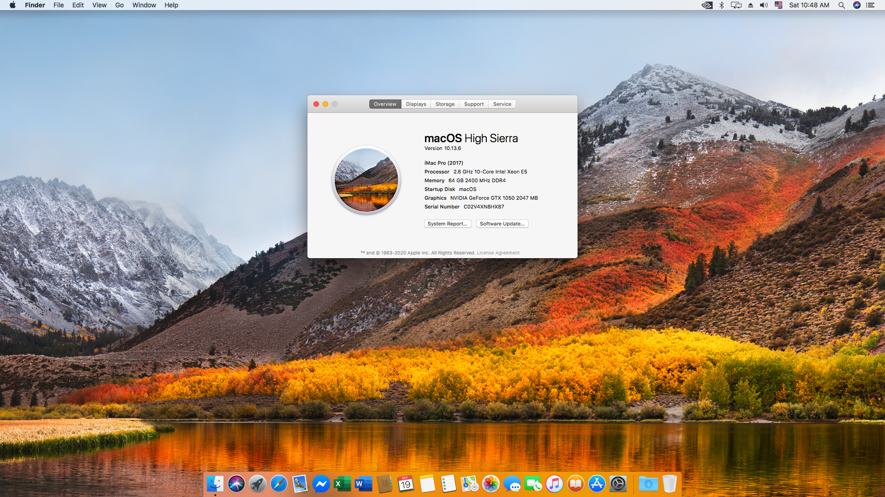
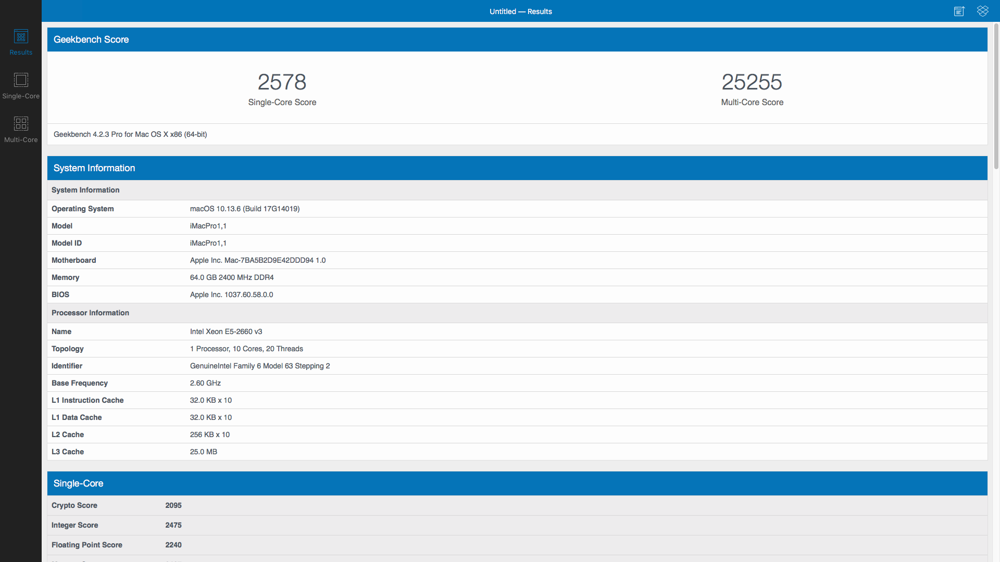
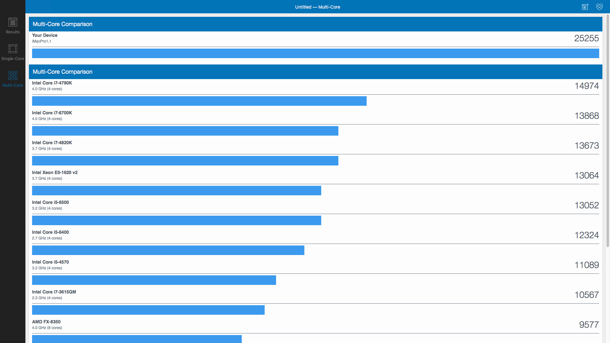
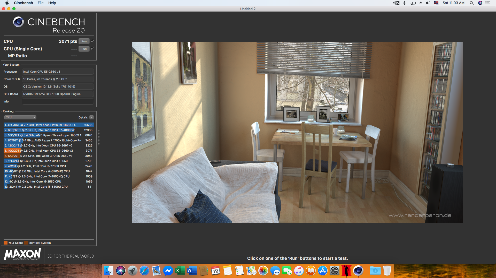

# macOS High Sierra 10.13.6
### UEFI Clover v2.5 r5102 for HUANANZHI X99-F8 GAMING Motherboard under control CX99DE25 BIOS

* #### How it work:

1) Download files
* EFI.zip
* Clover_v2.5k_r5102-UEFI.pkg
* Clover Configurator.app.zip 
2) Replace your EFI folder on USB (SSD) drive with a new one from the Zip archive.
3) After install macOS use Clover_v2.5k_r5102-UEFI.pkg, Clover Configurator.app (Replace default EFI folder on EFI partition)

* #### Specs:

1) HUANANZHI X99-F8 GAMING Motherboard (CX99DE25)
2) Intel Xeon E5-2660v3
3) Intel NVMe 512Gb M2 SSD
4) Nvidia Geforce GTX1050
5) RAM 4x16Gb PC2400 DDR4

* #### About this Mac

* #### Geekbench 4 Result

* #### Geekbench 4 Multi-Core Comparison

* #### CINEBENCH R20 result on macOS High Sierra 10.13.6 (17G14019)

